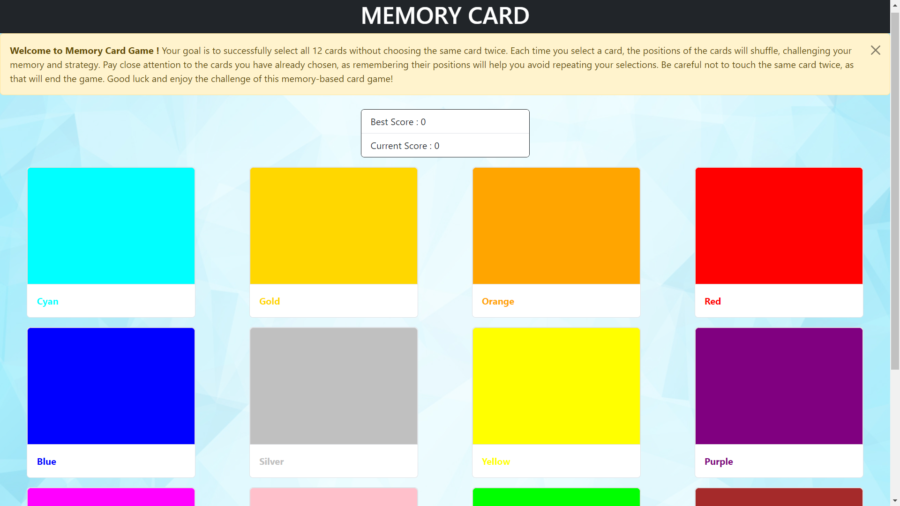

# Card Selection Game



Welcome to the Card Selection Game! Test your memory and strategy as you aim to select all 12 cards without choosing the same card twice. This game challenges your ability to remember card positions and make wise selections.

[Live Demo](memory-card-harshvsri.netlify.app)

## How to Play

1. Start the game by selecting a card.
2. Once you've chosen a card, the positions of the remaining cards will shuffle.
3. Carefully remember the cards you have already selected to avoid repeating your choices.
4. Keep selecting unique cards until you have chosen all 12 cards.
5. Be cautious not to touch the same card twice, as that will end the game.

## Features

- Interactive gameplay that tests your memory skills.
- Random shuffling of card positions for a unique experience each time.
- Easy-to-understand rules and user-friendly interface.

## Getting Started

1. Clone the repository.

   ```bash
   git clone https://github.com/your-username/card-selection-game.git
   cd card-selection-game
   npm install
   npm run dev
   ```

2. Open the game in your preferred web browser.
3. Follow the on-screen instructions to start playing.

## Contributing

Contributions are welcome! If you have any ideas, bug fixes, or improvements, feel free to submit a pull request.

## License

This project is licensed under the [MIT License](LICENSE).

## Acknowledgements

- The game was inspired by memory-based card games.
- Special thanks to [Khushi] for their contributions to the project.

Enjoy the Card Selection Game and have fun challenging your memory and strategy skills!
